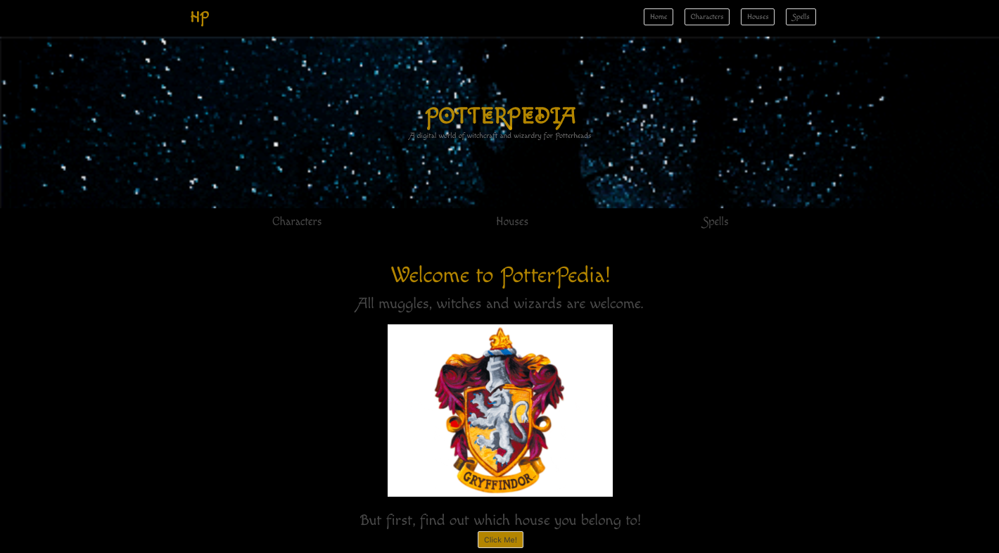
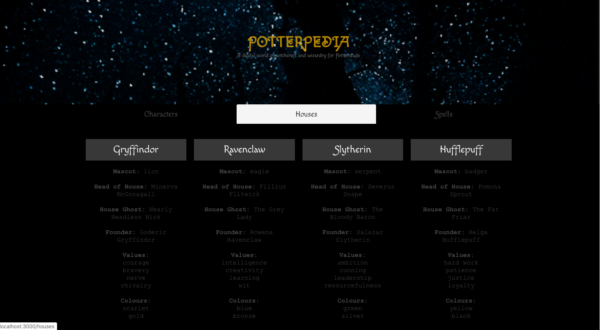
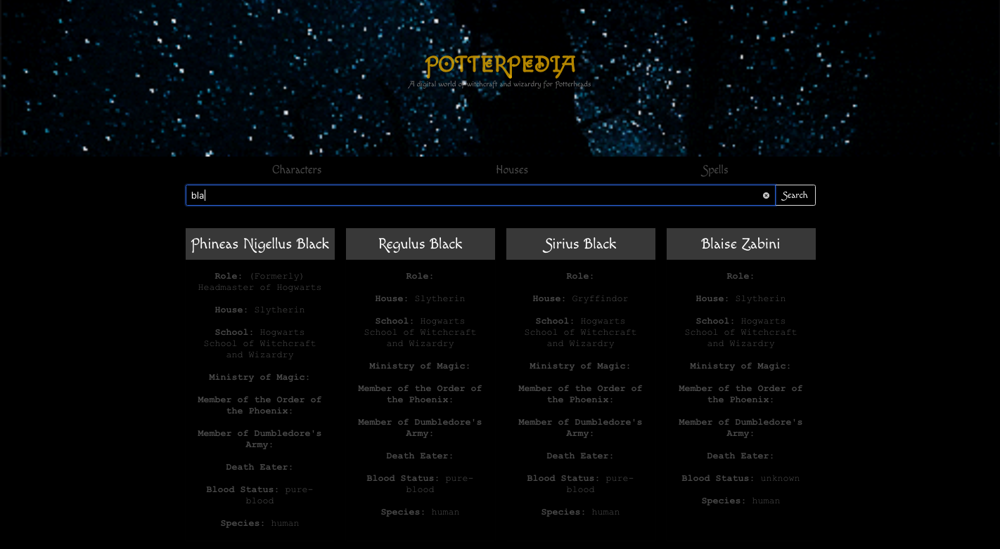
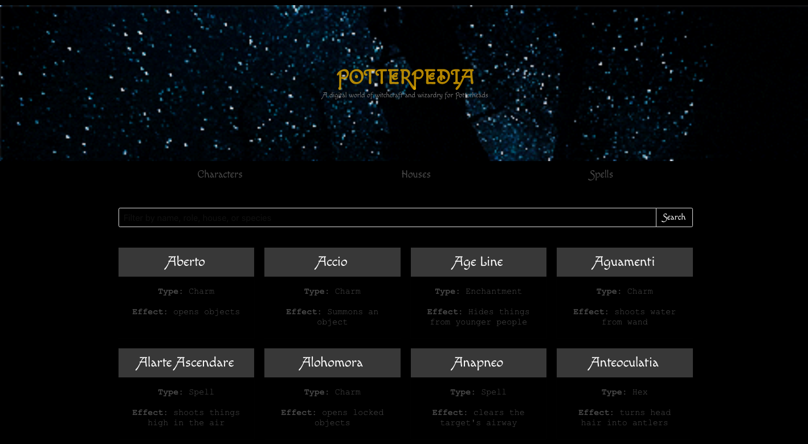
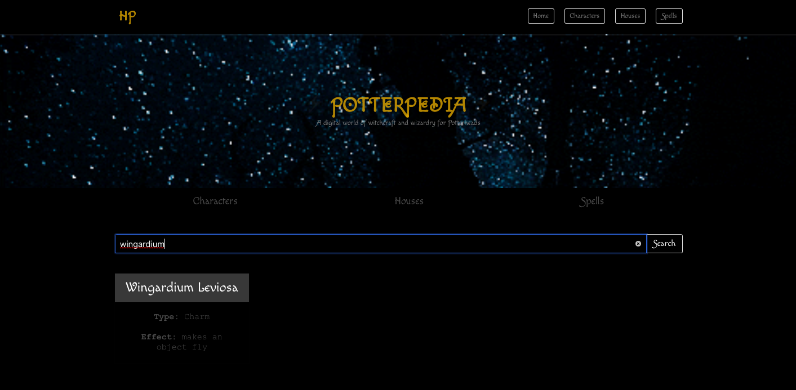

`yarn start` to run the development server


# PotterPedia

## Overview
A personal bonus project at General Assembly London.
This was a front-end project that utilised a [Harry Potter API](https://www.potterapi.com/) and `React.js`. I used CSS framework `Bulma` to aid in building this web app. This apps allow Potterheads to search for their favourite characters and learn more about each and every one of them. You can also learn more about the magic spells, as well as check for details about the Hogwarts houses. 

## Brief
- Consume a public API 
- Have several components - At least one classical and one functional.
- The app should include a router - with several "pages".
- Be deployed online and accessible to the public.

## Technologies Used
- JavaScript (ES6)
- React.js
- HTML, JSX
- Harry Potter API
- Axios
- Webpack
- Git and GitHub
- Bulma, SCSS
- GitHub Pages

////////////////////////////////////
# Approach


# App structure
## App.js 
```js
const App = () => (
  <BrowserRouter>
    <Hero />
    <Switch>
      <Route path="/characters" component={CharactersIndex} />
      <Route path="/houses" component={HousesIndex} />
      <Route path="/spells" component={SpellsIndex} />
      <Route path="/" component={SortingHat} />
    </Switch>
  </BrowserRouter>
)
```
In the app.js you can see the fundamental app structure, starting with the BrowserRouter. The Switch component has multiple Route components within and a Hero component placed outside so it's accessible on all endpoints. 

### CharacterIndex.js, HouseIndex.js and SpellsIndex.js

The three components have similar functionalities and make get requests to the corresponding API endpoints to retrieve the information about characters, houses and spells. The Harry Potter API requires an `authentication key`, which is included in the request endpoint in `componentDidMount()` per documentation advice. 

```js
componentDidMount() {
  axios.get('https://www.potterapi.com/v1/characters/?key=$2a$10$KlXbSlQJ6SoRxqxZoBgA1OEZqZ.OleSixEvf5uDMYgxO9ydsmjehm')
    .then(response => {
      this.setState({
        characters: response.data,
        filteredCharacters: response.data
      })
    })
    .catch(error => console.log(error))
}
```
## SearchForm.js
The `SearchForm.js` is a simple function component and it's used for searching characters and spells using Bulma search bar. The `search` and `onQuery` props are passed down to it from the corresponding class components `CharacterIndex.js` and `SpellsIndex.js` as the user types in the search bar. 

```js
const SearchForm = ({ query, onChange }) => {
  return (
    <div className="SearchForm">
      <div className="container">
        <div className="field has-addons">
          <div className="control is-expanded">
            <input
              className="input is-medium"
              type="search"
              placeholder="Filter by name, role, house, or species / spell name"
              value={query}
              onChange={onChange}
            />
          </div>
          <div className="control">
            <a className="button is-medium">Search</a>
          </div>
        </div>
      </div>
    </div>
  )
}
```

## Screenshots

// Image is a gif that shows all house crests and doesn't represent house you will get assigned to, the screenshot happened to capture Ravenclaw, which may seem like a mismatch to the Hufflepuff result. 😅







## Potential Future Features


## Wins


## Lessons Learned


## Other challenges


