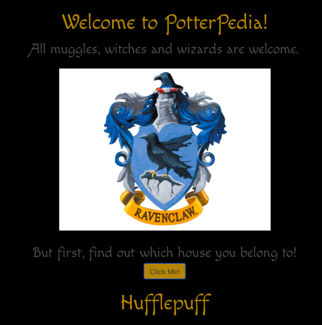
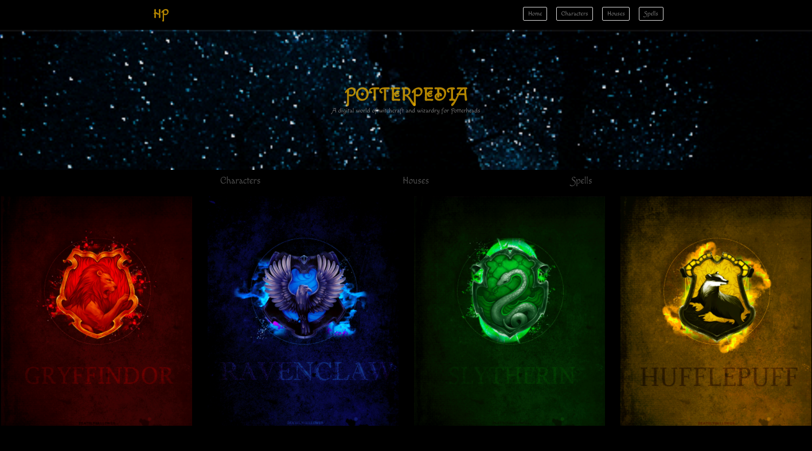

#  GA London React Template

`yarn start` to run the development server

`yarn build` to create a build directory


This project was bootstrapped with [Create React App](https://github.com/facebook/create-react-app).


# PotterPedia

## Overview
A personal bonus project at General Assembly London.
This was a front-end project that utilised a [Harry Potter API](https://www.potterapi.com/) and `React.js`. I used CSS framework `Bulma` to aid in building this web app. This apps allow Potterheads to search for their favourite characters and learn more about each and every one of them. You can also learn more about the magic spells, as well as check for details about the Hogwarts houses. 

## Brief
- Consume a public API 
- Have several components - At least one classical and one functional.
- The app should include a router - with several "pages".
- Be deployed online and accessible to the public.

## Technologies Used
- JavaScript (ES6)
- React.js
- HTML, JSX
- Harry Potter API
- Axios
- Webpack
- Git and GitHub
- Bulma, SCSS
- GitHub Pages

////////////////////////////////////
# Approach


# App structure
## App.js 
```js
const App = () => (
  <BrowserRouter>
    <Hero />
    <Switch>
      <Route path="/characters" component={CharactersIndex} />
      <Route path="/houses" component={HousesIndex} />
      <Route path="/spells" component={SpellsIndex} />
      <Route path="/" component={SortingHat} />
    </Switch>
  </BrowserRouter>
)
```
In the app.js you can see the fundamental app structure, starting with the BrowserRouter. The Switch component has multiple Route components within and a Hero component placed outside so it's accessible on all endpoints. 

### CharacterIndex.js, HouseIndex.js and SpellsIndex.js

The three components have similar functionalities and make get requests to the corresponding API endpoints to retrieve the information about characters, houses and spells. The Harry Potter API requires an `authentication key`, which is included in the request endpoint in `componentDidMount()` per documentation advice. 

```js
componentDidMount() {
  axios.get('https://www.potterapi.com/v1/characters/?key=$2a$10$KlXbSlQJ6SoRxqxZoBgA1OEZqZ.OleSixEvf5uDMYgxO9ydsmjehm')
    .then(response => {
      this.setState({
        characters: response.data,
        filteredCharacters: response.data
      })
    })
    .catch(error => console.log(error))
}
```
## SearchForm.js
The `SearchForm.js` is a simple function component and it's used for searching characters and spells using Bulma search bar. The `search` and `onQuery` props are passed down to it from the corresponding class components `CharacterIndex.js` and `SpellsIndex.js` as the user types in the search bar. 

```js
const SearchForm = ({ query, onChange }) => {
  return (
    <div className="SearchForm">
      <div className="container">
        <div className="field has-addons">
          <div className="control is-expanded">
            <input
              className="input is-medium"
              type="search"
              placeholder="Filter by name, role, house, or species / spell name"
              value={query}
              onChange={onChange}
            />
          </div>
          <div className="control">
            <a className="button is-medium">Search</a>
          </div>
        </div>
      </div>
    </div>
  )
}
```

## Screenshots





## Potential Future Features

- Genre-specific top charts
- Favourite song/artist section

## Wins
- Having just learnt React, creating a functional search bar in the navbar that is displayed and accessible on all endpoints was more complex than what I had done in class up to that point in time. Being able to eventually accomplish that was a big win.
- Another win was our app's bonus feature which allows the user to sample a song preview for 15seconds. Given the amount of time allowed for this project, it was our stretch goal at the start of the project.
- Creating a responsive design for the app and the burger navbar. 

## Lessons Learned

- Deployment
This was a main learning experience, as our project's navbar search engine is not functional after deploying it to GitHub pages. Even though we were warned of deployment challenges, as often with each project and its eccentricities, some functionalities are compromised, we did not anticipate our main feature to be affected. This goes to show that for projects with time constraints like this, sometimes it's better to focus on creating simple features that will be robust, rather than doing to many things at once. 

## Other challenges
We used a Bulma CSS framework for the styling, which proved to be a quick and efficient solution to styling the project, but found it to be fairy restrictive when trying to implement more creative elements.


